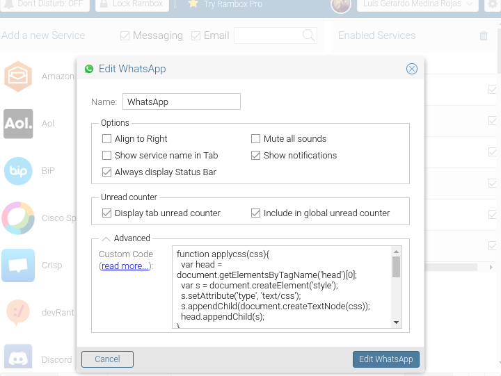

# rambox_themes
Project to maintain some rambox scripts to update the UI for web applications like telegram and whatsapp.
The themes are based on some userstyle css themes and updated to work the best way possible on the rambox application. 

If you want to create your theme is simple, just take as base the next code:

    function applycss(css){
      var head = document.getElementsByTagName('head')[0];
      var s = document.createElement('style');
      s.setAttribute('type', 'text/css');
      s.appendChild(document.createTextNode(css));
      head.appendChild(s);
    }
    applycss(`
      
       /** Copy here the CSS that you want to use **/
    
    `);

Today the css style developers usually implement the custom properties (--var), this properties are use as constants along all the css sheet but it doesn't work with the CSS injection that we are performing for rambox. So to have a complete functional script you need to replace those constants on the occurrences inside of the css code. 

Also try to have the css for one resolution, some times the @media tags are not interpreted when you inject css so try to use the base functions of css. 

After you have all your code complete you can set the javascript on the feature of rambox, (click on the gear and open the advance arrow).

